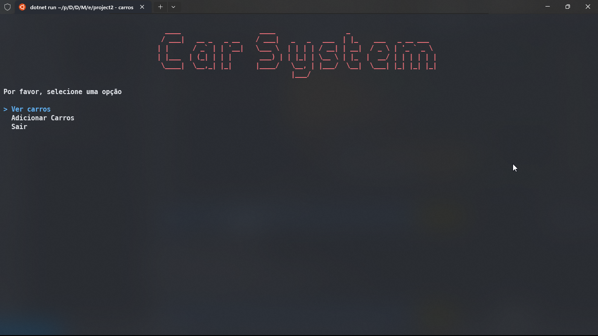
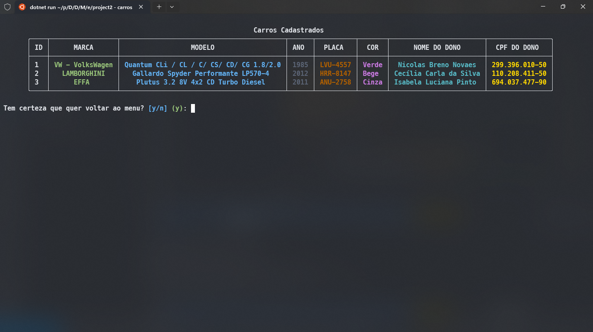
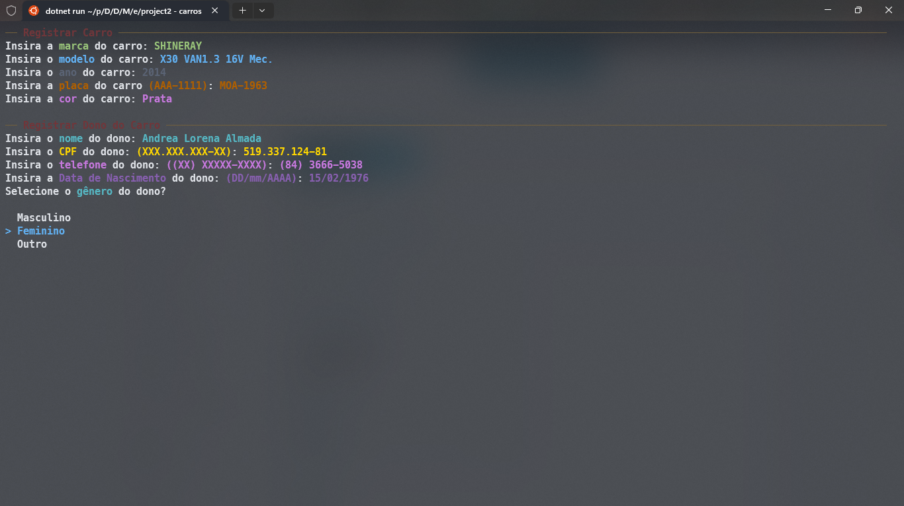
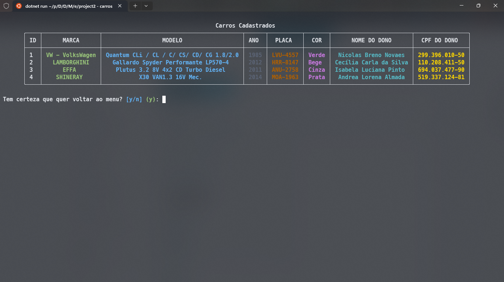
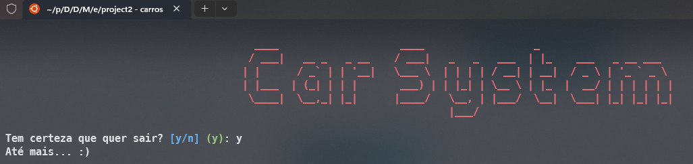

# CAR SYSTEM

Sistema de estudo realizado durante a terceira semana do módulo 2 do curso DEVinHouse - Audaces. Atividade introdutória para entender algumas das sintaxes e recursos que existem na linguagem C#. 

Trata-se de um sistema de console para criar carros e ver dados dos carros registrados.

## Requisitos e tecnologias usadas.

- C#
- .NET
- Spectre Console

## Como rodar o projeto: 

- Você pode rodar o projeto após instalar com 
```bash
dotnet restore
dotnet run
```

- Ao rodar o projeto, abrirá um menu com três opções, você pode escolher uma delas e seguir com o programa.



### Ver Carros

- Permite que você veja uma tabela com os dados dos carros registrados, ele já vem com três exemplos de carro.



### Adicionar Carro

- Permite que você adicione os dados de um novo carro, siga as instruções e use os padrões predefinidos.



- O carro será adicionado na tabela de carros caso queira vê-la novamente:



### Sair

- Você pode sair da aplicação a qualquer momento com o comando Ctrl + C, mas também pode selecionar essa opção:

